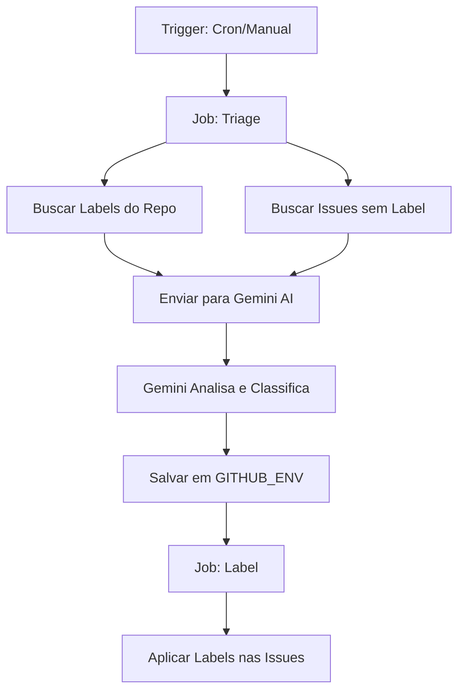

# 🤖 Configuração do Gemini Scheduled Triage

Este guia completo mostra como configurar o workflow de triage automático de issues usando Gemini AI.

## 📋 Pré-requisitos

- ✅ Gemini API Key (já configurado: `sua_gemini_api_key_aqui`)
- ✅ GitHub Token com permissões de issues (já configurado)
- ✅ GitHub CLI instalado (`gh`)

---

## 🚀 Passo a Passo de Configuração

### 1️⃣ Criar as Labels no Repositório

Execute o script de criação de labels (escolha a versão para seu sistema):

**No Windows (PowerShell):**
```powershell
# Defina o token
$env:GH_TOKEN = "seu_token_github_aqui"

# Execute o script
.\scripts\create-labels.ps1
```

**No Linux/Mac (Bash):**
```bash
# Defina o token
export GH_TOKEN="seu_token_github_aqui"

# Execute o script
bash scripts/create-labels.sh
```

**Ou manualmente via GitHub CLI:**
```bash
gh label create "bug" --repo PageCloudv1/xcloud-bot --color d73a4a --description "🐛 Algo não está funcionando" --force
gh label create "enhancement" --repo PageCloudv1/xcloud-bot --color a2eeef --description "✨ Nova funcionalidade" --force
gh label create "documentation" --repo PageCloudv1/xcloud-bot --color 0075ca --description "📚 Documentação" --force
gh label create "workflow" --repo PageCloudv1/xcloud-bot --color c2e0c6 --description "🔄 Workflows" --force
gh label create "ci-cd" --repo PageCloudv1/xcloud-bot --color fef2c0 --description "🚀 CI/CD" --force
gh label create "priority/high" --repo PageCloudv1/xcloud-bot --color d93f0b --description "🔥 Alta prioridade" --force
gh label create "priority/medium" --repo PageCloudv1/xcloud-bot --color fbca04 --description "⚡ Prioridade média" --force
gh label create "priority/low" --repo PageCloudv1/xcloud-bot --color 0e8a16 --description "🌱 Baixa prioridade" --force
gh label create "needs-triage" --repo PageCloudv1/xcloud-bot --color ededed --description "🔍 Precisa triagem" --force
gh label create "good first issue" --repo PageCloudv1/xcloud-bot --color 7057ff --description "👋 Bom para iniciantes" --force
```

### 2️⃣ Configurar Secrets no GitHub

Acesse: `https://github.com/PageCloudv1/xcloud-bot/settings/secrets/actions`

**Adicione os seguintes secrets:**

| Nome do Secret | Valor | Descrição |
|----------------|-------|-----------|
| `GEMINI_API_KEY` | `sua_gemini_api_key_aqui` | Chave da API do Gemini |

**Nota:** O workflow usa `github.token` automaticamente fornecido pelo GitHub Actions. Você não precisa criar um secret separado para o token do GitHub.

**Via GitHub CLI:**
```bash
gh secret set GEMINI_API_KEY --body "sua_gemini_api_key_aqui" --repo PageCloudv1/xcloud-bot
```

### 3️⃣ Configurar Variables (Opcional)

Acesse: `https://github.com/PageCloudv1/xcloud-bot/settings/variables/actions`

**Variáveis recomendadas:**

| Nome | Valor | Descrição |
|------|-------|-----------|
| `GEMINI_MODEL` | `gemini-2.0-flash-exp` | Modelo do Gemini a usar |
| `GEMINI_CLI_VERSION` | `latest` | Versão do Gemini CLI |

**Via GitHub CLI:**
```bash
gh variable set GEMINI_MODEL --body "gemini-2.0-flash-exp" --repo PageCloudv1/xcloud-bot
gh variable set GEMINI_CLI_VERSION --body "latest" --repo PageCloudv1/xcloud-bot
```

### 4️⃣ Ativar o Workflow

O workflow já está configurado em `.github/workflows/gemini-scheduled-triage.yml` e será executado:

- ✅ **A cada hora** (cron: `0 * * * *`)
- ✅ **Manualmente** via GitHub Actions UI
- ✅ **Em push/PR** quando o próprio workflow for modificado

**Para executar manualmente:**
```bash
gh workflow run "gemini-scheduled-triage.yml" --repo PageCloudv1/xcloud-bot
```

Ou via UI: https://github.com/PageCloudv1/xcloud-bot/actions/workflows/gemini-scheduled-triage.yml

---

## 🧪 Testar o Workflow

### Criar uma Issue de Teste

```bash
gh issue create \
  --repo PageCloudv1/xcloud-bot \
  --title "Teste de Triage Automático" \
  --body "Esta é uma issue de teste para verificar se o Gemini consegue classificar corretamente. O bot deveria responder automaticamente aos comandos mas não está funcionando."
```

### Executar o Workflow Manualmente

```bash
gh workflow run "gemini-scheduled-triage.yml" --repo PageCloudv1/xcloud-bot
```

### Verificar os Resultados

1. Acesse: https://github.com/PageCloudv1/xcloud-bot/actions
2. Clique na execução mais recente de "📋 Gemini Scheduled Issue Triage"
3. Verifique os logs dos jobs `triage` e `label`
4. Confirme que a issue recebeu as labels corretas

---

## 📊 Labels Disponíveis

### Tipos de Issue
- `bug` - 🐛 Algo não está funcionando
- `enhancement` - ✨ Nova funcionalidade
- `documentation` - 📚 Melhorias na documentação
- `workflow` - 🔄 Relacionado a workflows
- `ci-cd` - 🚀 CI/CD e deploys

### Prioridades
- `priority/high` - 🔥 Alta prioridade
- `priority/medium` - ⚡ Prioridade média
- `priority/low` - 🌱 Baixa prioridade

### Estados
- `needs-triage` - 🔍 Precisa ser triado
- `good first issue` - 👋 Bom para iniciantes

### Outras
- `help wanted` - 🤝 Ajuda bem-vinda
- `wontfix` - ⛔ Não será implementado
- `duplicate` - 📋 Duplicada
- `invalid` - ❌ Inválida
- `question` - ❓ Pergunta

---

## 🔧 Como Funciona

### Fluxo do Workflow



### O que o Gemini AI Faz

1. **Lê** as issues abertas sem labels ou com `needs-triage`
2. **Analisa** o título e corpo da issue
3. **Classifica** baseado nos labels disponíveis
4. **Retorna** um JSON com as labels recomendadas
5. **Aplica** as labels automaticamente

### Exemplo de Análise

**Issue:**
```
Título: Bot não responde aos comandos
Corpo: Quando tento usar /help, o bot não responde nada...
```

**Gemini AI decide:**
```json
{
  "issue_number": 123,
  "labels_to_set": ["bug", "priority/high"],
  "explanation": "Funcionalidade crítica não está operacional"
}
```

---

## 🛡️ Segurança

### Tokens e Secrets

- ✅ **Nunca** commite tokens no código
- ✅ Use GitHub Secrets para dados sensíveis
- ✅ O `GITHUB_TOKEN` padrão já tem permissões suficientes
- ✅ A Gemini API Key está isolada em secrets

### Permissões do Workflow

O workflow possui permissões mínimas:
```yaml
permissions:
  contents: read      # Ler código
  issues: write       # Aplicar labels
  pull-requests: read # Ler PRs
```

---

## 🔄 Ajustes e Personalização

### Alterar Frequência de Execução

Edite `.github/workflows/gemini-scheduled-triage.yml`:

```yaml
on:
  schedule:
    - cron: '0 */6 * * *'  # A cada 6 horas
    # - cron: '0 0 * * *'  # Diariamente à meia-noite
    # - cron: '0 9 * * 1'  # Toda segunda às 9h
```

### Adicionar Mais Labels

1. Adicione a label no script `scripts/create-labels.ps1`
2. Execute o script novamente
3. O Gemini automaticamente considerará as novas labels

### Modificar o Prompt do Gemini

Edite o campo `prompt` no workflow para ajustar como o Gemini classifica as issues.

---

## 🐛 Troubleshooting

### Workflow não executa

**Verifique:**
- ✅ O workflow está habilitado em Actions
- ✅ Os secrets estão configurados
- ✅ Há issues sem labels ou com `needs-triage`

### Gemini não classifica corretamente

**Soluções:**
- Ajuste o prompt do Gemini no workflow
- Adicione mais contexto nos templates de issues
- Revise as labels disponíveis

### Erro de autenticação

**Verifique:**
- ✅ `GEMINI_API_KEY` está correto
- ✅ `GITHUB_TOKEN` tem permissões de escrita em issues
- ✅ A API Key não expirou

---

## 📚 Recursos Adicionais

- [Gemini API Documentation](https://ai.google.dev/docs)
- [GitHub Actions Secrets](https://docs.github.com/en/actions/security-guides/encrypted-secrets)
- [GitHub Issue Labels](https://docs.github.com/en/issues/using-labels-and-milestones-to-track-work/managing-labels)
- [Cron Syntax](https://crontab.guru/)

---

## ✅ Checklist de Configuração

- [ ] Labels criadas no repositório
- [ ] `GEMINI_API_KEY` adicionado aos secrets
- [ ] `GITHUB_TOKEN` configurado
- [ ] Issue templates atualizados
- [ ] Workflow testado manualmente
- [ ] Primeira issue classificada com sucesso

---

**Pronto!** Seu sistema de triage automático está configurado! 🎉

O Gemini AI agora vai classificar suas issues automaticamente a cada hora.
