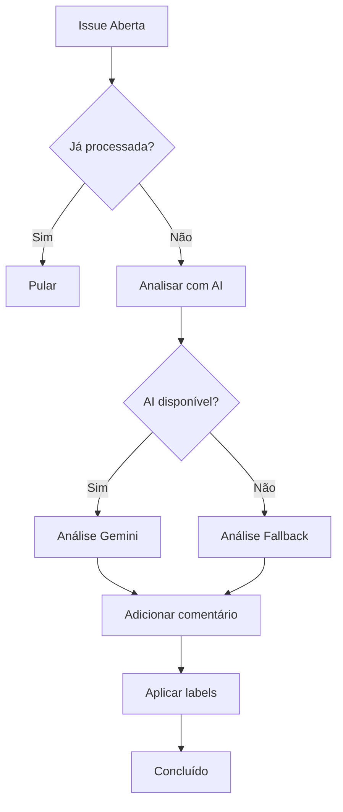
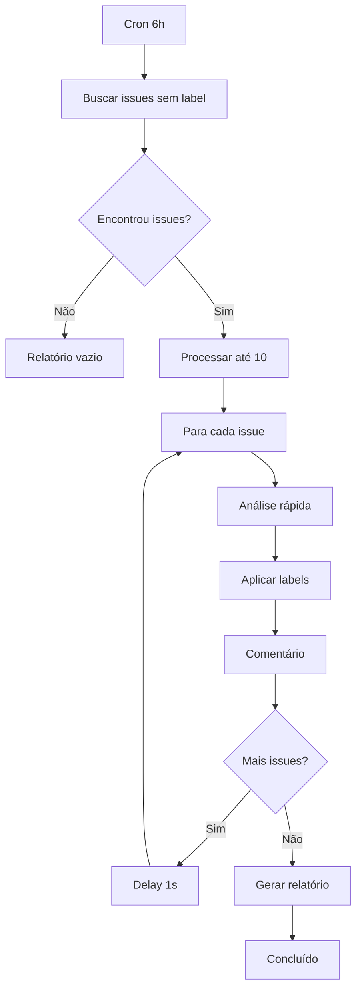

# 🏷️ Issue Management Workflow - Guia Completo

## 📋 Visão Geral

O workflow **Issue Management** automatiza completamente o gerenciamento de issues no repositório, incluindo:

- ✅ Análise automática de novas issues com IA
- ✅ Aplicação inteligente de labels
- ✅ Comentários de boas-vindas personalizados
- ✅ Triagem em lote de issues pendentes
- ✅ Relatórios de estatísticas

## 🎯 Funcionalidades

### 1. Processamento Individual Automático

**Quando acontece:**
- Issue é aberta (`opened`)
- Issue é editada (`edited`)
- Issue é reaberta (`reopened`)

**O que faz:**
1. 🔍 Analisa o título e descrição da issue
2. 🤖 Usa IA (Gemini) para análise inteligente (se disponível)
3. 🏷️ Aplica labels relevantes automaticamente
4. 📊 Define prioridade (low/medium/high/critical)
5. 🗂️ Categoriza tecnicamente (ci-cd, bot, workflow, etc.)
6. 💬 Adiciona comentário de boas-vindas explicando próximos passos

**Análise com IA:**
```
Título: Implementar sistema de cache
Descrição: Precisamos adicionar cache para melhorar performance...

Resultado:
- Labels: enhancement, priority-medium, performance
- Prioridade: medium
- Categoria: backend
- Comentário: "Olá! Sua sugestão de implementar cache foi analisada..."
```

**Fallback sem IA:**
Se a API do Gemini não estiver disponível, o workflow usa análise baseada em palavras-chave:
- Detecta "bug", "erro", "error" → Label: `bug`, Prioridade: `high`
- Detecta "feature", "enhancement" → Label: `enhancement`
- Detecta "doc", "documentação" → Label: `documentation`
- Detecta "?", "question", "dúvida" → Label: `question`, Prioridade: `low`

### 2. Triagem em Lote (Scheduled)

**Quando acontece:**
- Automaticamente a cada 6 horas (cron: `0 */6 * * *`)
- Manualmente via workflow_dispatch

**O que faz:**
1. 🔍 Busca issues sem labels ou marcadas como `needs-triage`
2. 📝 Processa até 10 issues por execução
3. 🏷️ Aplica labels baseado em análise rápida
4. 💬 Adiciona comentário de triagem
5. ⏱️ Rate limiting (1s entre cada issue)

**Exemplo de busca:**
```
Issues encontradas: 15
Processando: 10 (limite)
- Issue #42: Bug no login → Labels: bug, priority-high
- Issue #43: Nova feature → Labels: enhancement, priority-medium
- ...
```

### 3. Execução Manual

**Como usar:**

1. Vá em **Actions** → **Issue Management**
2. Clique em **Run workflow**
3. Opções:
   - **issue_number**: Número da issue específica (ex: `42`)
   - **force_reanalysis**: `true` para forçar reanálise

**Casos de uso:**
- Processar uma issue específica que foi ignorada
- Reanalisar issue após edição significativa
- Triagem manual de lote sem esperar o cron

## 🔧 Configuração

### Secrets Necessários

```yaml
# .github/workflows/issue-management.yml
env:
  GEMINI_API_KEY: ${{ secrets.GEMINI_API_KEY }}  # Opcional (usa fallback se não disponível)
  GEMINI_MODEL: ${{ vars.GEMINI_MODEL || 'gemini-2.0-flash-exp' }}
```

**Obter GEMINI_API_KEY:**
1. Acesse [Google AI Studio](https://makersuite.google.com/app/apikey)
2. Crie uma API Key
3. Adicione como secret no GitHub: Settings → Secrets → Actions → New secret

### Variáveis de Repositório

```yaml
GEMINI_MODEL: 'gemini-2.0-flash-exp'  # Opcional, padrão já definido
```

### Permissions Necessárias

```yaml
permissions:
  contents: read      # Ler código do repositório
  issues: write       # Criar comentários e adicionar labels
  pull-requests: read # Distinguir issues de PRs
```

## 📊 Labels Sugeridas pelo Workflow

### Tipos
- `bug` - Erro ou comportamento inesperado
- `enhancement` - Nova funcionalidade ou melhoria
- `documentation` - Relacionado a documentação
- `question` - Pergunta ou dúvida
- `duplicate` - Issue duplicada
- `help wanted` - Ajuda necessária
- `good first issue` - Boa para iniciantes

### Prioridade
- `priority-low` - Baixa prioridade
- `priority-medium` - Prioridade média
- `priority-high` - Alta prioridade
- `priority-critical` - Crítica/urgente

### Categorias Técnicas
- `workflow` - GitHub Actions, CI/CD
- `bot` - Automação, bot
- `ci-cd` - Integração/Deploy contínuo
- `frontend` - Interface, UI
- `backend` - Servidor, API
- `database` - Banco de dados
- `security` - Segurança
- `infrastructure` - Infraestrutura

### Status
- `needs-triage` - Precisa ser triada

## 📈 Monitoramento

### Logs do Workflow

```bash
# Visualizar logs
1. Vá em Actions → Issue Management
2. Selecione uma execução
3. Veja logs detalhados de cada job
```

### Estatísticas (Schedule Job)

O job `report-statistics` gera relatório automático:

```
📊 Estatísticas de Issues:
   Total de issues abertas: 25
   Com labels: 20 (80%)
   Sem labels: 5
   Precisam triagem: 3
   Bugs: 8
   Melhorias: 10
   Perguntas: 2
```

## 🐛 Troubleshooting

### Issue não foi processada

**Causa**: Workflow pode estar desabilitado ou issue já processada
**Solução**:
1. Verifique se workflow está ativo em Actions
2. Execute manualmente com `force_reanalysis: true`

### Labels não foram aplicadas

**Causa**: Labels podem não existir no repositório
**Solução**:
1. Crie as labels manualmente: Settings → Labels
2. O workflow logará avisos sobre labels inexistentes

### AI não está funcionando

**Causa**: GEMINI_API_KEY não configurado ou inválido
**Solução**:
1. Verifique se secret existe
2. Workflow usará fallback automaticamente
3. Logs mostrarão: "⚠️ Erro na análise AI: ..."

### Rate limit da API

**Causa**: Muitas requisições em pouco tempo
**Solução**:
1. Workflow já tem delay de 1s entre issues
2. Limite de 10 issues por execução do batch
3. Aguarde alguns minutos antes de executar novamente

## 🔄 Fluxo de Execução

### Evento: Issue Aberta



### Evento: Triagem Cron



## 📝 Exemplos de Uso

### Exemplo 1: Bug Report

**Issue:**
```
Título: Erro ao fazer login
Descrição: Quando tento fazer login, recebo erro 500...
```

**Resultado:**
- Labels: `bug`, `priority-high`
- Comentário: "Identificamos um bug... equipe foi notificada..."

### Exemplo 2: Feature Request

**Issue:**
```
Título: Adicionar suporte a dark mode
Descrição: Seria legal ter um tema escuro...
```

**Resultado:**
- Labels: `enhancement`, `priority-medium`, `good first issue`
- Comentário: "Sugestão registrada! Categoria: frontend..."

### Exemplo 3: Pergunta

**Issue:**
```
Título: Como configuro o bot?
Descrição: Não entendi como configurar...
```

**Resultado:**
- Labels: `question`, `documentation`, `priority-low`
- Comentário: "Olá! Sua dúvida foi categorizada como pergunta..."

## 🎓 Boas Práticas

1. **Mantenha labels atualizadas** - Crie as labels sugeridas no repositório
2. **Monitore o workflow** - Revise logs periodicamente
3. **Ajuste o cron** - Altere frequência conforme necessidade
4. **Use force_reanalysis** - Para issues que mudaram significativamente
5. **Configure GEMINI_API_KEY** - Para análises mais inteligentes
6. **Revise triagens** - Bot é assistente, revisão humana é importante

## 🚀 Próximos Passos

- [ ] Adicionar integração com projetos GitHub
- [ ] Auto-assign de responsáveis
- [ ] Templates de resposta personalizados
- [ ] Integração com Slack/Discord para notificações
- [ ] Machine learning para melhorar detecção
- [ ] Suporte a múltiplos idiomas

## 📚 Referências

- [GitHub Actions Docs](https://docs.github.com/en/actions)
- [GitHub Script Action](https://github.com/actions/github-script)
- [Gemini API](https://ai.google.dev/)
- [Issue Automation Best Practices](https://docs.github.com/en/issues)

---

**Criado por**: xCloud Bot Team
**Última atualização**: 2024
**Versão**: 1.0.0
