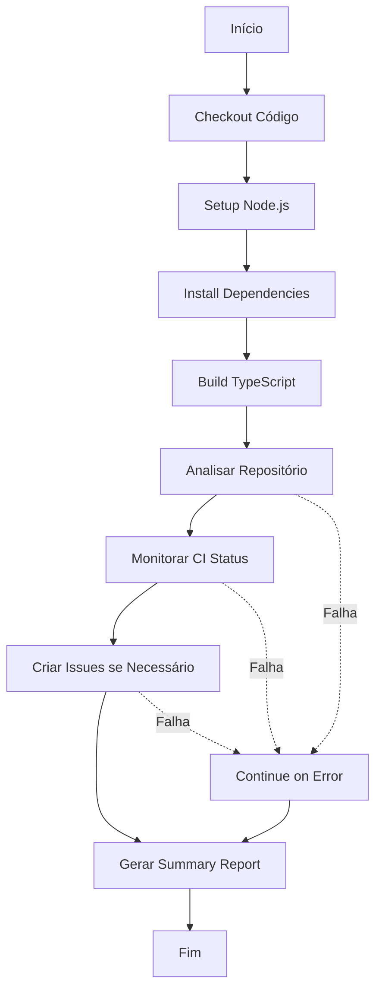

# 🔄 Bot Integration Workflow - Guia Completo

Este documento detalha a configuração e uso do workflow `.github/workflows/bot_integration.yml` para integração completa do xCloud Bot com GitHub.

## 📋 Visão Geral

O workflow `bot_integration.yml` automatiza:
- ✅ Análise de repositórios
- ✅ Monitoramento de CI/CD
- ✅ Criação automática de issues
- ✅ Geração de relatórios de saúde

## 🚀 Como Funciona

### Triggers Automáticos

O workflow é executado:

1. **Schedule (Cron)**: A cada 6 horas
   ```yaml
   schedule:
     - cron: '0 */6 * * *'
   ```

2. **Manual (workflow_dispatch)**: Via interface do GitHub
   - Opção para analisar todos os repositórios xCloud

3. **Push para main**: Quando arquivos do bot são modificados
   ```yaml
   push:
     branches: [main]
     paths:
       - '.github/workflows/**'
       - 'src/bot/**'
       - 'src/workflows/**'
   ```

### Fluxo de Execução



## ⚙️ Configuração Necessária

### 1. Permissões do Workflow

O workflow já está configurado com as permissões mínimas necessárias:

```yaml
permissions:
  contents: read       # Ler código do repositório
  issues: write        # Criar e editar issues
  actions: read        # Ler status de workflows
  pull-requests: write # Comentar em PRs
```

**Importante**: Essas permissões são aplicadas automaticamente pelo GitHub Actions quando o workflow executa.

### 2. Secrets Necessários

Configure os secrets no repositório:

#### Via GitHub UI:
```
Repositório → Settings → Secrets and variables → Actions → New repository secret
```

#### Secrets:

| Nome | Tipo | Descrição | Obrigatório |
|------|------|-----------|-------------|
| `GITHUB_TOKEN` | Automático | Token fornecido pelo GitHub Actions | ✅ Sim |
| `GITHUB_APP_ID` | Manual | ID da GitHub App (para webhooks) | ⚠️ Opcional |
| `GITHUB_PRIVATE_KEY` | Manual | Chave privada da GitHub App | ⚠️ Opcional |
| `GEMINI_API_KEY` | Manual | API key do Gemini para análise IA | ⚠️ Opcional |

#### GITHUB_TOKEN (Automático)

O `GITHUB_TOKEN` é fornecido automaticamente pelo GitHub Actions. Você **não precisa criar** este secret manualmente.

#### GITHUB_APP_ID e GITHUB_PRIVATE_KEY (Opcional)

Necessários apenas se você quiser usar webhooks da GitHub App:

1. **Criar GitHub App**:
   - Acesse: `https://github.com/settings/apps/new`
   - Preencha nome, homepage URL, webhook URL
   - Configure permissões (veja seção abaixo)
   - Gere e baixe a private key

2. **Adicionar ao Repository**:
   ```bash
   # GITHUB_APP_ID
   Settings → Secrets → New secret
   Name: GITHUB_APP_ID
   Value: 123456 (seu app ID)

   # GITHUB_PRIVATE_KEY
   Settings → Secrets → New secret
   Name: GITHUB_PRIVATE_KEY
   Value: (cole conteúdo completo da private key)
   ```

#### GEMINI_API_KEY (Opcional)

Para análise com IA usando Google Gemini:

1. **Obter API Key**:
   - Acesse: https://makersuite.google.com/app/apikey
   - Crie uma nova API key

2. **Adicionar ao Repository**:
   ```bash
   Settings → Secrets → New secret
   Name: GEMINI_API_KEY
   Value: (sua API key)
   ```

### 3. Configuração da GitHub App (Opcional)

Se você optar por usar a GitHub App para webhooks:

#### Permissões Repository:

| Permissão | Acesso | Uso |
|-----------|--------|-----|
| **Contents** | Read | Ler código e arquivos |
| **Issues** | Read & Write | Criar/editar issues |
| **Pull Requests** | Read & Write | Comentar em PRs |
| **Actions** | Read | Monitorar workflows |
| **Metadata** | Read | Informações do repo |

#### Eventos (Webhooks):

Marque os seguintes eventos:

- ✅ **Issues** - Para auto-labeling
- ✅ **Issue comments** - Para responder comentários
- ✅ **Pull requests** - Para análise de PRs
- ✅ **Pull request reviews** - Para reviews
- ✅ **Workflow runs** - Para monitorar CI
- ✅ **Push** - Para detectar mudanças

#### Webhook URL:

Se você hospedar o bot:
```
https://seu-dominio.com/webhook
```

Se usar apenas via GitHub Actions:
```
Deixe em branco ou use placeholder
```

## 🎯 Uso do Workflow

### Execução Manual

1. **Acessar Actions**:
   ```
   Repositório → Actions → 🤖 xCloud Bot Integration
   ```

2. **Executar Workflow**:
   - Clique em `Run workflow`
   - Selecione branch: `main`
   - (Opcional) Marque `analyze_all` para analisar todos os repos
   - Clique em `Run workflow`

3. **Acompanhar Execução**:
   - Veja os logs em tempo real
   - Verifique o summary ao final

### Análise de Resultados

Após cada execução, você verá:

#### 1. Workflow Summary

```markdown
## 🤖 xCloud Bot Integration Report

### 📊 Execution Summary
- **Repository:** `PageCloudv1/xcloud-bot`
- **Trigger:** `workflow_dispatch`
- **Timestamp:** 2024-01-15 10:30:00 UTC

### ✅ Step Results
- **Analysis:** success
- **Monitoring:** success
- **Issue Creation:** success
```

#### 2. Logs Detalhados

Cada step gera logs específicos:
- 📊 Análise: Métricas de workflows, saúde do repo
- 🔍 Monitoramento: Status de CI, falhas detectadas
- 🤖 Issues: Issues criadas automaticamente

#### 3. Issues Criadas

Issues são criadas automaticamente quando:
- ✅ Múltiplas falhas de workflow detectadas
- ✅ Workflows lentos identificados (> 10min)
- ✅ Taxa de sucesso < 80%
- ✅ Repositórios sem workflows configurados

## 🔧 Customização

### Alterar Frequência do Schedule

Edite o arquivo `.github/workflows/bot_integration.yml`:

```yaml
schedule:
  # A cada 6 horas
  - cron: '0 */6 * * *'
  
  # Diariamente às 9h UTC
  # - cron: '0 9 * * *'
  
  # A cada 2 horas
  # - cron: '0 */2 * * *'
  
  # Segunda a sexta às 8h UTC
  # - cron: '0 8 * * 1-5'
```

### Adicionar Notificações

Para receber notificações em caso de falha:

```yaml
- name: Notify on Failure
  if: failure()
  uses: actions/github-script@v7
  with:
    script: |
      github.rest.issues.create({
        owner: context.repo.owner,
        repo: context.repo.repo,
        title: '🚨 Bot Integration Failed',
        body: 'Workflow run failed. See: ${{ github.server_url }}/${{ github.repository }}/actions/runs/${{ github.run_id }}',
        labels: ['bug', 'ci-failure']
      })
```

### Adicionar Steps Customizados

Você pode adicionar steps adicionais:

```yaml
- name: Custom Analysis
  run: |
    echo "🔍 Executando análise customizada..."
    node scripts/custom-analysis.js
```

## 📊 Métricas e Monitoramento

### O que é Analisado

1. **Performance de Workflows**:
   - Tempo médio de execução
   - Taxa de sucesso/falha
   - Workflows lentos (> 10min)
   
2. **Saúde do Repositório**:
   - Workflows ativos vs inativos
   - Falhas recentes (últimas 24h)
   - Configuração de CI/CD

3. **Artefatos**:
   - Artefatos antigos (> 7 dias)
   - Uso de storage

### Tipos de Issues Criadas

#### 🚨 Alert: Múltiplas Falhas
```markdown
Título: 🚨 Alert: Múltiplas falhas de workflow detectadas
Labels: alert, ci-health, priority-high, bot-created

Foram detectadas X falhas nas últimas 24 horas.
- Workflow 1 - Branch X
- Workflow 2 - Branch Y
```

#### ⚠️ Warning: Workflow Lento
```markdown
Título: ⚠️ Performance: Workflow lento detectado
Labels: performance, workflow, bot-created

Workflow "CI" tem tempo médio de execução > 10min
Recomendação: Otimizar steps, usar cache
```

#### 📋 Info: Sem Workflows
```markdown
Título: 📋 Setup: Repositório sem workflows configurados
Labels: enhancement, ci-cd, bot-created

Recomendação: Implementar CI/CD básico
```

## 🐛 Troubleshooting

### Workflow Falha ao Instalar Dependências

**Erro**: `npm install` falha

**Solução**:
```yaml
# Use npm ci em vez de npm install
- name: Install Dependencies
  run: npm ci --prefer-offline --no-audit
```

### Sem Permissão para Criar Issues

**Erro**: `Error: Resource not accessible by integration`

**Solução**:
1. Verifique as permissões do workflow:
   ```yaml
   permissions:
     issues: write
   ```

2. Verifique se o token está sendo passado:
   ```yaml
   env:
     GITHUB_TOKEN: ${{ secrets.GITHUB_TOKEN }}
   ```

### Análise Não Encontra Repositórios

**Erro**: `No repositories found`

**Solução**:
1. Verifique se o token tem acesso à organização
2. Confirme que os repositórios começam com `xcloud-`
3. Teste manualmente:
   ```bash
   export GITHUB_TOKEN=your_token
   npm run analyze:all
   ```

### Timeout em Steps

**Erro**: Step timeout após 120 segundos

**Solução**:
```yaml
- name: Long Running Step
  timeout-minutes: 10  # Aumenta timeout
  run: npm run long-task
```

## 📚 Referências

- [GitHub Actions Documentation](https://docs.github.com/en/actions)
- [GitHub Apps Permissions](https://docs.github.com/en/apps/creating-github-apps/setting-up-a-github-app/setting-permissions-for-github-apps)
- [Workflow Syntax](https://docs.github.com/en/actions/using-workflows/workflow-syntax-for-github-actions)
- [Octokit REST API](https://octokit.github.io/rest.js/)

## 💡 Dicas e Melhores Práticas

1. **Use Cache**: O workflow já usa cache de npm para builds mais rápidos

2. **Continue on Error**: Steps críticos usam `continue-on-error: true` para não parar o workflow

3. **Environment Variables**: Sempre defina `CI=true` para modo CI

4. **Secrets**: Nunca commite secrets no código, sempre use GitHub Secrets

5. **Logs**: Use `echo` para gerar logs informativos em cada step

6. **Summary**: Use `$GITHUB_STEP_SUMMARY` para relatórios visuais

7. **Testing**: Teste localmente antes de commitar:
   ```bash
   export GITHUB_TOKEN=your_token
   export CI=true
   npm run build
   npm run scheduler:run
   ```

## 🆘 Suporte

Se você tiver problemas:

1. **Verifique Logs**: Actions → Workflow → View logs
2. **Teste Localmente**: Execute os scripts manualmente
3. **Abra Issue**: Descreva o problema com logs
4. **Consulte README**: Veja documentação principal

---

**Última atualização**: 2024
**Mantido por**: xCloud Team
